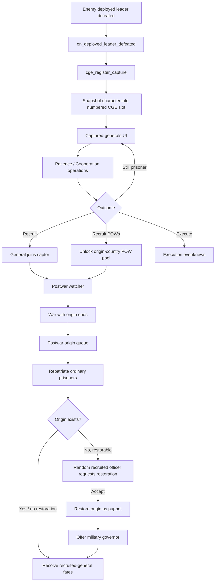

# Captured Generals Expanded

Captured Generals Expanded (CGE) expands Hearts of Iron IV's captured-general gameplay into a persistent prisoner-management system. Captured commanders are tracked in a custom interface and can be pressured, interrogated, tried, executed, recruited, or used to organize POW formations. When a war ends, CGE also resolves prisoners and recruited collaborators from the defeated country, including optional country restoration and military-governor events.

## Requirements

- Hearts of Iron IV `1.19.*`

The mod descriptor is in [`descriptor.mod`](descriptor.mod).

## Main features

- Persistent captured-general registry with saved stats, traits, portraits, origin country, and capture state.
- Sortable captured-general list and detailed prisoner overview UI.
- Two main prisoner values: **Patience** and **Cooperation**.
- Timed prisoner operations with costs, success/failure branches, history, and country modifiers.
- Four-stage trial event chain with public, military, and plea-agreement routes.
- Execution and recruitment events.
- POW recruitment pools derived from casualties inflicted on each origin country.
- Recruiter assignment and dynamically created POW divisions.
- Postwar repatriation and recruited-general fate events.
- Restoration request from one randomly selected recruited officer when their annexed homeland can be restored.
- Military-governor selection for restored or otherwise subject postwar governments.

## Documentation

- [`docs/ARCHITECTURE.md`](docs/ARCHITECTURE.md) — how the systems fit together.
- [`docs/GAMEPLAY_SYSTEMS.md`](docs/GAMEPLAY_SYSTEMS.md) — player-facing mechanics, costs, requirements, and outcomes.
- [`docs/POSTWAR_SYSTEM.md`](docs/POSTWAR_SYSTEM.md) — peace detection, restoration requests, governor selection, and recruited-general fates.
- [`docs/DATA_MODEL.md`](docs/DATA_MODEL.md) — slots, variables, flags, event targets, and arrays.
- [`docs/UI_AND_CONTENT.md`](docs/UI_AND_CONTENT.md) — scripted GUI, interface files, localisation, portraits, and generated registries.
- [`docs/CODE_REFERENCE.md`](docs/CODE_REFERENCE.md) — file-by-file and effect/event/trigger reference.
- [`docs/DEBUGGING.md`](docs/DEBUGGING.md) — useful log messages and places to inspect when a flow fails.

## High-level runtime flow

## Important source entry points

The most useful files to start with are:

- [`common/on_actions/cge_gameplay_on_actions.txt`](common/on_actions/cge_gameplay_on_actions.txt) — capture, daily processing, weekly POW tick, state-control refresh.
- [`common/scripted_effects/cge_core_effects.txt`](common/scripted_effects/cge_core_effects.txt) — capture registration and slot removal.
- [`common/scripted_effects/cge_operation_effects.txt`](common/scripted_effects/cge_operation_effects.txt) — starting/canceling prisoner operations and trial setup.
- [`common/scripted_effects/cge_daily_effects.txt`](common/scripted_effects/cge_daily_effects.txt) — operation timers and completion effects.
- [`common/scripted_effects/cge_prisoner_effects.txt`](common/scripted_effects/cge_prisoner_effects.txt) — POW pools, recruiters, and division creation.
- [`common/on_actions/cge_postwar_on_actions.txt`](common/on_actions/cge_postwar_on_actions.txt) — peace hooks.
- [`common/scripted_effects/cge_postwar_effects.txt`](common/scripted_effects/cge_postwar_effects.txt) — complete postwar state machine.
- [`events/cge_postwar_events.txt`](events/cge_postwar_events.txt) — all postwar player decisions.
- [`common/scripted_guis/cge_ui_scripted_gui.txt`](common/scripted_guis/cge_ui_scripted_gui.txt) — UI button behavior.

## Repository notes

Several files are intentionally very large because they act as generated lookup/compatibility tables rather than hand-authored gameplay logic, especially `cge_pow_templates.txt`, `cge_character_registry.txt`, the portrait/trait resolvers, and runtime portrait localisation/GFX files. See [`docs/UI_AND_CONTENT.md`](docs/UI_AND_CONTENT.md) before editing those files manually.
