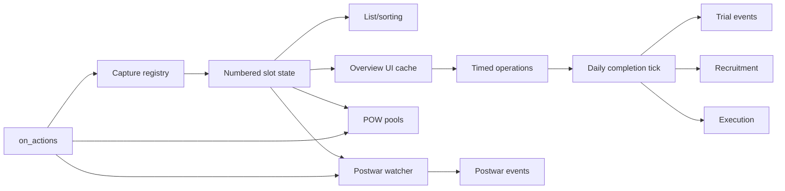

# Architecture

CGE is built around a **country-owned numbered slot registry**. When the player captures an eligible deployed leader, the mod snapshots that character into a slot (`1..cge_captured_general_count`). Nearly every other system reads or mutates that slot rather than trying to derive all state directly from the live HOI4 character.

## System map

## 1. Capture and registration

[`common/on_actions/cge_gameplay_on_actions.txt`](../common/on_actions/cge_gameplay_on_actions.txt) listens to `on_deployed_leader_defeated`. If `can_be_captured = yes` and the victorious/captor scope is the human player, it calls [`cge_register_capture`](../common/scripted_effects/cge_core_effects.txt#L3).

`cge_register_capture` delegates the difficult character work to [`cge_prepare_capture_snapshot_on_from`](../common/scripted_effects/cge_character_registry.txt#L3713) and related registry helpers. The snapshot records identity, rank/skills, traits, portrait keys, held state, origin country, and other CGE-specific state before a numbered slot is initialized.

The character registry exists because HOI4 character scopes and captured-leader state are awkward to use as the sole persistent data model. CGE therefore keeps its own mirror of the information it needs.

## 2. Slot storage

[`common/scripted_effects/cge_sorting_effects.txt`](../common/scripted_effects/cge_sorting_effects.txt) owns most generic slot operations:

- `cge_clear_slot_data` resets a slot.
- `cge_copy_slot_data` moves a slot during compaction/sorting work.
- `cge_mirror_slot_to_character` copies important CGE state back onto the live character.
- `cge_init_slot` / `cge_init_slots` initialize slot structures.
- `cge_list_rebuild`, `cge_list_refresh`, and `cge_list_sync` maintain the display list.
- `cge_sort_display` and the `cge_sort_*_click` effects implement sorting.

The slot layer is the shared dependency of the UI, POW, operation, and postwar systems.

## 3. UI and caches

The physical GUI is declared in [`interface/cge_interface.gui`](../interface/cge_interface.gui). HOI4 UI widgets are wired to gameplay effects through [`common/scripted_guis/cge_ui_scripted_gui.txt`](../common/scripted_guis/cge_ui_scripted_gui.txt).

The overview does not read every slot field directly. [`cge_refresh_selected_cache`](../common/scripted_effects/cge_overview_effects.txt#L252) loads the selected slot into `cge_cache_*` and `cge_overview_*` variables. Scripted triggers then use this cache to decide which buttons are enabled.

This pattern keeps UI conditions readable and avoids duplicating slot-index metaprogramming in every button trigger.

## 4. Timed prisoner operations

[`common/scripted_effects/cge_operation_effects.txt`](../common/scripted_effects/cge_operation_effects.txt) handles selection, costs, timers, history, starting, and canceling operations.

[`common/scripted_effects/cge_daily_effects.txt`](../common/scripted_effects/cge_daily_effects.txt) runs the timers and applies the completion result. This split is important:

- `operation_effects` = player starts/cancels/configures an operation.
- `daily_effects` = time passes and the result actually happens.

Country-level temporary penalties are implemented through [`common/dynamic_modifiers/cge_dynamic_modifiers.txt`](../common/dynamic_modifiers/cge_dynamic_modifiers.txt).

## 5. Trial events

The trial is a multi-stage event chain in [`events/cge_gameplay_events.txt`](../events/cge_gameplay_events.txt). The event options call small effects in [`common/scripted_effects/cge_event_effects.txt`](../common/scripted_effects/cge_event_effects.txt), which update the trial route/severity/negotiation state and schedule the next stage.

The final verdict is then integrated back into the main operation state.

## 6. POW recruitment

[`common/scripted_effects/cge_prisoner_effects.txt`](../common/scripted_effects/cge_prisoner_effects.txt) maintains one POW pool per origin country, not one pool per individual general. A collaborator can be assigned as the recruiter for that origin-country pool.

[`common/scripted_effects/cge_pow_templates.txt`](../common/scripted_effects/cge_pow_templates.txt) is the large template/probing/spawning implementation used to create the POW division and calculate required manpower/equipment.

The seven-day update is launched from the normal `on_daily` hook by counting days in `cge_pow_weekly_tick_days`.

## 7. Postwar state machine

The postwar system is intentionally separate from normal daily prisoner logic.

[`common/on_actions/cge_postwar_on_actions.txt`](../common/on_actions/cge_postwar_on_actions.txt) reacts to `on_peaceconference_ended` and `on_peace`. It schedules a deferred scan rather than immediately doing all postwar work inside the on-action scope.

The scan and all postwar branching live in [`common/scripted_effects/cge_postwar_effects.txt`](../common/scripted_effects/cge_postwar_effects.txt), with per-slot helpers in [`common/scripted_effects/cge_slot_effects.txt`](../common/scripted_effects/cge_slot_effects.txt). Player-facing choices are in [`events/cge_postwar_events.txt`](../events/cge_postwar_events.txt).

See [`POSTWAR_SYSTEM.md`](POSTWAR_SYSTEM.md) for the full state machine.

## 8. Generated/static content

Several large files are mostly lookup tables:

- `cge_character_registry.txt` — character identity/trait/stat snapshot helpers.
- `cge_pow_templates.txt` — division-template selection and generation data.
- `cge_portrait_resolvers.txt` — scripted-localisation portrait resolution.
- `cge_trait_resolvers.txt` — scripted-localisation trait resolution.
- `cge_runtime_portraits.gfx` and matching localisation — runtime portrait sprites/keys.

They are dependencies of the hand-authored systems, but they are not the best starting point for understanding gameplay flow.
