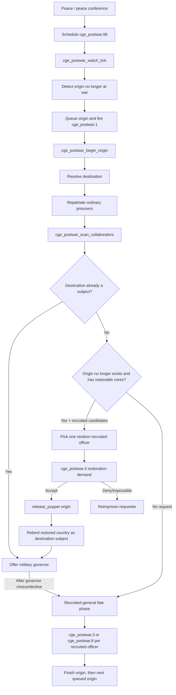

# Postwar system

The postwar system resolves CGE prisoners when hostilities with their **country of origin** end. It handles ordinary repatriation, recruited collaborators, restoration of annexed countries, and optional military governors.

## Event chain at a glance

## Peace detection

[`common/on_actions/cge_postwar_on_actions.txt`](../common/on_actions/cge_postwar_on_actions.txt) provides two hooks:

- `on_peaceconference_ended` tries to identify the exact origin country involved and calls `cge_postwar_arm_exact_peace_origin`.
- `on_peace` schedules a scan for any human country whose postwar watcher is active.

The deferred scan is [`cge_postwar.99`](../events/cge_postwar_events.txt#L370). It clears the scheduling guard and calls [`cge_postwar_watch_tick`](../common/scripted_effects/cge_postwar_effects.txt#L898).

The watch tick first marks origin countries that are/used to be at war with the player, then [`cge_slot_postwar_detect`](../common/scripted_effects/cge_slot_effects.txt#L190) detects the transition from war to peace. The detected origin is added to `cge_postwar_origin_queue`, and [`cge_postwar.1`](../events/cge_postwar_events.txt#L3) starts processing it.

## Origin processing

[`cge_postwar_begin_origin`](../common/scripted_effects/cge_postwar_effects.txt#L133) does three things:

1. Resolves the postwar destination country.
2. Repatriates ordinary prisoners.
3. Continues into collaborator/recruited-general processing once the information event is cleared.

[`cge_postwar_resolve_destination`](../common/scripted_effects/cge_postwar_effects.txt#L1038) prefers:

1. The historical origin tag itself if it is a direct subject of the player.
2. Otherwise, another player subject that owns one of the historical origin's core states.
3. Otherwise, the historical origin scope remains the display/reference destination until a later branch changes it.

## Ordinary prisoners

[`cge_postwar_repatriate`](../common/scripted_effects/cge_postwar_effects.txt#L343) removes ordinary, living, unrecruited, non-collaborator prisoners from that origin and sends them to the resolved destination.

If anyone was repatriated, [`cge_postwar.2`](../events/cge_postwar_events.txt#L21) displays an informational event before processing continues.

## Restoration request

The restoration request is generated by [`cge_postwar_try_autonomy_request`](../common/scripted_effects/cge_postwar_effects.txt#L417).

It only enters this branch when:

- The historical origin country **does not currently exist**.
- The player owns at least one state that is a core of the historical origin.
- That state is **not** also a core or claim of the player.
- At least one living recruited general from that origin remains in CGE's slots.

Per-slot eligibility is checked by [`cge_slot_postwar_autonomy_candidate`](../common/scripted_effects/cge_slot_effects.txt#L96).

Eligible recruited officers are added to `cge_postwar_autonomy_candidates`. HOI4's `random_scope_in_array` then chooses exactly one of them, stores it as `cge_postwar_general`, stores its slot index in `cge_postwar_selected_slot`, and schedules [`cge_postwar.4`](../events/cge_postwar_events.txt#L110).

This means the restoration demand is intentionally **one random recruited officer per processed origin**, not one event per recruited officer.

## `cge_postwar.4` — restoration decision

The event offers three outcomes:

- **Accept** — restore the country under player protection.
- **Deny** — costs 100 Political Power, removes the requester's collaboration/recruited status, and returns the officer to captivity.
- **Impossible** — used if no eligible homeland state is available by the time the event resolves; the officer is reimprisoned without the political-power denial cost.

Accept calls [`cge_postwar_restore_origin_as_puppet`](../common/scripted_effects/cge_postwar_effects.txt#L620).

### Restoration implementation

The restore effect temporarily removes historical-origin cores from any states that are also the player's own cores/claims, calls `release_puppet`, and then restores those removed cores. This prevents the restoration operation from giving away states that the player is supposed to retain.

Immediately after `release_puppet`, the restored origin is explicitly rebound as `cge_postwar_destination`, and the captor receives:

- `cge_postwar_destination_found`
- `cge_postwar_destination_is_subject`

`cge_postwar_governor_considered` is cleared so that the next collaborator scan can enter the governor phase.

That explicit rebinding is required because the governor path tests the captor's postwar destination flags rather than assuming `release_puppet` has updated CGE's own state.

## Military governor flow

[`cge_postwar_offer_governor`](../common/scripted_effects/cge_postwar_effects.txt#L668) scans the slots for living recruited officers whose origin is the current historical origin. Eligibility is checked by [`cge_slot_governor_probe`](../common/scripted_effects/cge_slot_effects.txt#L119).

If at least one candidate exists, [`cge_postwar.5`](../events/cge_postwar_events.txt#L174) is scheduled.

### `cge_postwar.5` — proposal

- **Consider the candidates** builds the first candidate page and fires `cge_postwar.6`.
- **Leave the existing government in place** skips appointment and resumes postwar collaborator processing.

### `cge_postwar.6` / `.7` — candidate pages

[`cge_postwar_build_governor_page`](../common/scripted_effects/cge_postwar_effects.txt#L694) scans slots starting after `cge_postwar_governor_cursor` and loads up to three eligible candidates into:

- `cge_postwar_candidate_slot_1..3`
- `cge_postwar_candidate_1_display..3_display`
- matching global event targets

The `.6` and `.7` events alternate when paging so HOI4 can reopen what is effectively the same selection screen.

### Appointment

Choosing a candidate calls [`cge_postwar_appoint_selected_governor`](../common/scripted_effects/cge_postwar_effects.txt#L759).

The chosen officer:

- is released from captivity if necessary;
- receives the destination country's nationality;
- loses CGE captured/bribed/recruited/POW-unlock flags;
- is promoted into a country-leader role in the destination;
- receives an ideology matching the destination's current government family;
- receives `cge_postwar_eager_collaborator`;
- is removed from the captor's CGE slot list.

The destination is marked `cge_postwar_has_cge_governor` and records which overlord installed the governor in `cge_postwar_installed_by_country`.

The governor trait reduces subject autonomy gain and gives additional civilian-industry transfer to the overlord. See [`common/country_leader/cge_postwar_traits.txt`](../common/country_leader/cge_postwar_traits.txt).

## Recruited-general fate phase

After the governor phase (or if no governor/restoration path applies), [`cge_postwar_scan_recruited_fates`](../common/scripted_effects/cge_postwar_effects.txt#L466) processes remaining recruited generals from that origin one at a time.

[`cge_slot_postwar_fate`](../common/scripted_effects/cge_slot_effects.txt#L41) gives each unprocessed recruited officer a weighted random preference:

- weight **3**: wants repatriation → `cge_postwar.3`
- weight **2**: wants to stay → `cge_postwar.8`

The player can respect or overrule that preference. Overruling costs 100 Political Power. In the “wants to return” case, overruling also halves Patience and Cooperation and returns the officer to captivity.

Once all recruited officers for that origin have been processed, `cge_postwar_finish_origin` cleans state and advances the origin queue.

## Postwar event reference

| Event | Purpose |
|---|---|
| `cge_postwar.1` | Hidden origin-queue dispatcher |
| `cge_postwar.2` | Ordinary-prisoner repatriation information |
| `cge_postwar.3` | Recruited general wants to return home |
| `cge_postwar.4` | Random recruited officer requests restoration of annexed homeland |
| `cge_postwar.5` | Ask whether to install a military governor |
| `cge_postwar.6` | Governor candidate selection page A |
| `cge_postwar.7` | Governor candidate selection page B / pagination partner |
| `cge_postwar.8` | Recruited general wants to remain in service |
| `cge_postwar.99` | Deferred peace scan |
